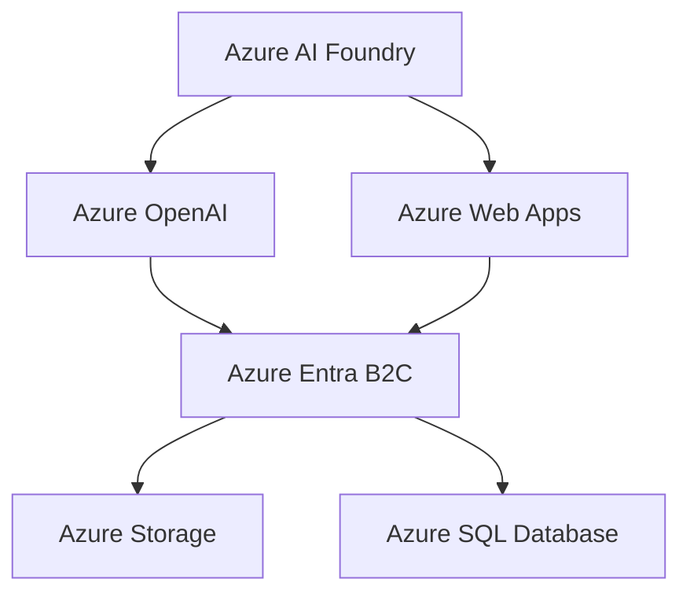

<div align="center">
  <h1>
    
    AI Architecture Assistant
    
  </h1>

  <p>Transform cloud architecture design with AI-powered intelligence</p>

  <div>
    <a href="https://www.youtube.com/watch?v=6kldr_9t9pE" target="_blank">
      
    </a>
    <a href="https://azureaideveloperhackathon.azurewebsites.net/" target="_blank">
      
    </a>
  </div>
</div>

## 🌟 Project Summary

AI Architecture Assistant is an innovative solution developed for the Azure AI Developer Hackathon that revolutionizes cloud architecture design. By leveraging Azure OpenAI and AI Foundry accelerators, it provides intelligent recommendations, automated diagrams, and infrastructure as code generation.

## 🤔 Why AI Architecture Assistant?

In today's rapidly evolving cloud landscape, architects and developers need tools that can keep pace with complexity while maintaining best practices. AI Architecture Assistant combines artificial intelligence with deep cloud expertise to streamline the architecture design process.

## 🎯 The Challenge & Our Solution

### The Challenge
- Time-consuming manual architecture design process
- Inconsistent application of best practices
- Complex decision-making across multiple cloud services
- Difficulty in maintaining up-to-date documentation
- Risk of security oversights and compliance issues

### Our Solution
- Automated architecture recommendations based on requirements
- Real-time best practice validation
- Intelligent service selection and configuration
- Automated documentation generation
- Built-in security and compliance checks

## 💫 Key Benefits

- **⏱️ Time Efficiency**: 75% reduction in architecture design time
- **🛡️ Enhanced Security**: Consistent security best practices
- **💰 Cost Optimization**: 40% average infrastructure cost savings
- **🤝 Collaboration**: Improved team productivity

## 👥 Who Benefits?

- **Cloud Architects**: Accelerated architecture design, best practice validation
- **DevOps Engineers**: Infrastructure as code generation, deployment automation
- **Solution Architects**: Rapid prototyping, pattern recognition
- **Technical Leaders**: Informed decision making, risk reduction

## 📊 Business Impact

- **75%** Reduction in design time
- **40%** Cost savings
- **90%** Accuracy improvement
- **60%** Faster deployment

## 💭 Example Prompts

```plaintext
1. Design a scalable e-commerce platform with high availability and disaster recovery
2. Create a microservices architecture for a real-time analytics platform
3. Build a serverless data processing pipeline with event-driven architecture
```

## ⚙️ How It Works

1. **Select Cloud Provider**: Choose between AWS, Azure, or Google Cloud Platform
2. **Describe Requirements**: Explain your architecture needs in plain English
3. **Generate Architecture**: AI analyzes requirements and generates comprehensive design
4. **Review & Export**: Export designs as PowerPoint or PDF for stakeholder review

## 🚀 Key Features

- **AI-Powered Design**: Intelligent architecture recommendations
- **Multi-Cloud Support**: AWS, Azure, and GCP support
- **Infrastructure as Code**: Automated Terraform generation
- **Cost Analysis**: Real-time cost estimation
- **Documentation Export**: Multiple format support
- **Security First**: Built-in security best practices

## 🏗️ Architecture Overview



## 💻 Tech Stack

### Frontend
- React 18.3 with TypeScript
- Vite for build optimization
- Three.js for 3D visualization
- Framer Motion animations
- TailwindCSS for styling
- React Flow for diagrams

### Azure Services
- Azure OpenAI Service
- Azure Web App Service
- Azure App Insights
- Azure Monitoring
- Azure SQL Database
- Azure Entra B2C

## 🚀 Deployment

### Prerequisites
- Node.js 18.0.0 or higher
- Azure subscription
- Azure CLI

### Environment Variables
Create a `.env` file in the root directory:

```env
# Azure OpenAI Configuration
VITE_AZURE_OPENAI_ENDPOINT=https://your-endpoint.openai.azure.com/
VITE_AZURE_OPENAI_KEY=your-api-key

# Azure B2C Configuration
VITE_AZURE_B2C_CLIENT_ID=your-client-id
VITE_AZURE_B2C_AUTHORITY=https://your-tenant.b2clogin.com/your-tenant.onmicrosoft.com/policy-name
VITE_AZURE_B2C_KNOWN_AUTHORITY=https://your-tenant.b2clogin.com
VITE_AZURE_B2C_REDIRECT_URI=http://localhost:5173/

# Azure Storage
VITE_AZURE_STORAGE_CONNECTION_STRING=your-storage-connection-string
VITE_AZURE_STORAGE_CONTAINER_NAME=your-container-name
```

### Installation & Setup

```bash
# Clone the repository
git clone https://github.com/TWILIGHTCLOUDCODERZ/Azure-AI-Architect-Assistant.git

# Navigate to project directory
cd Azure-AI-Architect-Assistant

# Install dependencies
npm install

# Start development server
npm run dev

# Build for production
npm run build
```

## 📝 License

This project is licensed under the MIT License - see the [LICENSE](LICENSE) file for details.

## 🤝 Contributing

Contributions are welcome! Please feel free to submit a Pull Request.

## 👨‍💻 Author

**DeepanRaj Vellingiri**
- 📧 Email: deepanrey@gmail.com
- 🌐 Website: [https://deepantechnoids.github.io/](https://deepantechnoids.github.io/)
- 💼 LinkedIn: [https://www.linkedin.com/in/deepanraj95/](https://www.linkedin.com/in/deepanraj95/)
- 🐱 GitHub: [https://github.com/TWILIGHTCLOUDCODERZ](https://github.com/TWILIGHTCLOUDCODERZ)

---

<div align="center">
  <p>Built with ❤️ for Azure AI Developer Hackathon</p>
  <p>Powered by Azure Services</p>
</div>
