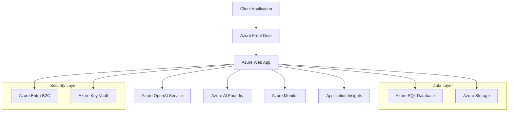
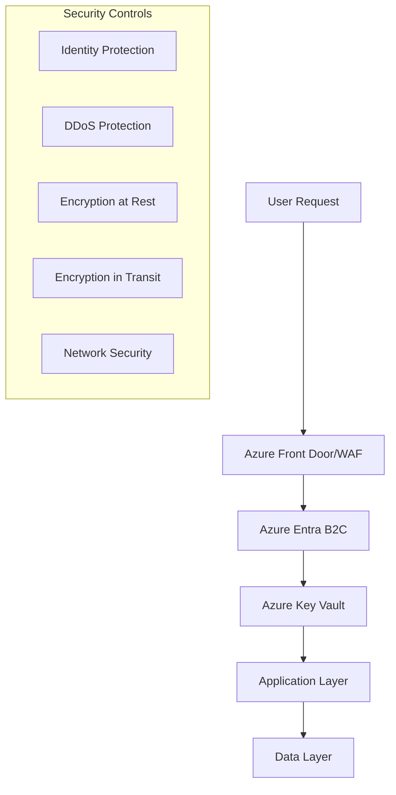

<div align="center">
  <div class="relative">
    <div class="absolute inset-0 bg-gradient-to-r from-blue-500 via-purple-500 to-pink-500 rounded-full blur-xl opacity-50"></div>
    <h1 class="relative z-10 flex items-center justify-center space-x-3 text-4xl font-bold">
      
      <span>AI Architecture Assistant</span>
      
    </h1>
  </div>

  <p align="center" class="text-xl text-gray-400 mt-4">Transform cloud architecture design with AI-powered intelligence</p>

  <div class="flex justify-center space-x-4 mt-6">
    <a href="https://www.youtube.com/watch?v=6kldr_9t9pE" target="_blank">
      
    </a>
    <a href="https://azureaideveloperhackathon.azurewebsites.net/" target="_blank">
      
    </a>
  </div>
</div>

## 🌟 Project Overview

AI Architecture Assistant is a groundbreaking solution developed for the Azure AI Developer Hackathon that revolutionizes cloud architecture design. By leveraging Azure OpenAI and AI Foundry accelerators, it provides intelligent recommendations, automated diagrams, and infrastructure as code generation.

### 🎯 Key Features

- **🤖 AI-Powered Design**
  - Intelligent architecture recommendations
  - Pattern recognition and best practices
  - Automated cost optimization
  - Security compliance validation

- **📊 Interactive Visualization**
  - Real-time 3D architecture diagrams
  - Component relationship mapping
  - Performance metrics visualization
  - Resource utilization insights

- **🚀 Automation & Efficiency**
  - Infrastructure as Code generation
  - Automated documentation
  - CI/CD pipeline integration
  - Deployment automation

- **🛡️ Security & Compliance**
  - Built-in security best practices
  - Compliance checking
  - Vulnerability scanning
  - Access control management

## 💫 Business Impact

<div align="center">

| Metric | Improvement |
|--------|-------------|
| 🕒 Design Time | 75% Reduction |
| 💰 Cost Savings | 40% Average |
| ✨ Accuracy | 90% Improvement |
| 🚀 Deployment | 60% Faster |

</div>
## 🏗️ System Architecture

### High-Level Architecture


### Component Details

#### 1. Frontend Layer
- **Client Application**
  - React 18.3 with TypeScript
  - Three.js for 3D visualization
  - Real-time architecture diagrams
  - Interactive user interface
  - Progressive Web App capabilities

- **Azure Front Door**
  - Global load balancing
  - SSL termination
  - DDoS protection
  - Web Application Firewall

#### 2. Application Layer
- **Azure Web App**
  - Node.js runtime
  - Auto-scaling enabled
  - Deployment slots for zero-downtime updates
  - Integrated with CI/CD pipeline

- **Azure OpenAI Service**
  - GPT-4 model integration
  - Natural language processing
  - Context-aware responses
  - Architecture pattern recognition

- **Azure AI Foundry**
  - Custom model development
  - MLOps automation
  - Model deployment optimization
  - Performance monitoring

#### 3. Security Layer
- **Azure Entra B2C**
  - Identity management
  - Multi-factor authentication
  - Role-based access control
  - Single sign-on capabilities

- **Azure Key Vault**
  - Secret management
  - Certificate storage
  - Encryption key management
  - Secure configuration storage

#### 4. Data Layer
- **Azure SQL Database**
  - User data storage
  - Architecture metadata
  - Audit logging
  - Automated backups
  - Geo-replication

- **Azure Storage**
  - Architecture diagrams
  - Generated artifacts
  - Blob storage for assets
  - Queue storage for background jobs

#### 5. Monitoring & Analytics
- **Application Insights**
  - Real-time monitoring
  - Performance metrics
  - User behavior analytics
  - Custom event tracking

- **Azure Monitor**
  - Resource health monitoring
  - Alert management
  - Log analytics
  - Diagnostic settings

### Security Architecture



### Data Flow

1. **User Request Flow**
   - Request reaches Azure Front Door
   - WAF policies applied
   - Authentication via Azure B2C
   - Route to nearest web app instance

2. **Processing Flow**
   - Web app processes request
   - OpenAI service generates recommendations
   - AI Foundry provides accelerators
   - Results stored in database

3. **Response Flow**
   - Processed results returned
   - Real-time updates via WebSocket
   - Metrics logged to Application Insights
   - Response cached when applicable

### Scalability Features

- **Horizontal Scaling**
  - Auto-scaling web apps
  - Load-balanced distribution
  - Multi-region deployment
  - Database scaling

- **Performance Optimization**
  - CDN integration
  - Caching strategies
  - Resource optimization
  - Query optimization

### Disaster Recovery

- **High Availability**
  - Active-active deployment
  - Geo-redundant storage
  - Automated failover
  - Data replication

- **Backup Strategy**
  - Automated backups
  - Point-in-time recovery
  - Geo-redundant backup
  - Regular testing
## 🎨 Technical Stack

### Frontend Technologies
- ⚛️ React 18.3 with TypeScript
- 🎨 Tailwind CSS for styling
- 🌟 Three.js for 3D visualization
- 🎭 Framer Motion animations
- 📊 React Flow for diagrams
- 🔄 Vite for build optimization

### Azure Services
- 🧠 Azure OpenAI Service
- ☁️ Azure Web App Service
- 📊 Azure App Insights
- 🔍 Azure Monitoring
- 🗄️ Azure SQL Database
- 🔐 Azure Entra B2C

## 🚀 Getting Started

### Prerequisites
```bash
# Required versions
Node.js >= 18.0.0
Azure subscription
Azure CLI
```

### Environment Setup
```env
# Azure OpenAI Configuration
VITE_AZURE_OPENAI_ENDPOINT=https://your-endpoint.openai.azure.com/
VITE_AZURE_OPENAI_KEY=your-api-key

# Azure B2C Configuration
VITE_AZURE_B2C_CLIENT_ID=your-client-id
VITE_AZURE_B2C_AUTHORITY=https://your-tenant.b2clogin.com/your-tenant.onmicrosoft.com/policy-name
VITE_AZURE_B2C_KNOWN_AUTHORITY=https://your-tenant.b2clogin.com
VITE_AZURE_B2C_REDIRECT_URI=http://localhost:5173/

# Azure Storage
VITE_AZURE_STORAGE_CONNECTION_STRING=your-storage-connection-string
VITE_AZURE_STORAGE_CONTAINER_NAME=your-container-name
```

### Quick Start
```bash
# Clone repository
git clone https://github.com/TWILIGHTCLOUDCODERZ/AI-POWERED-INTELIGENCE.git

# Navigate to project
cd AI-POWERED-INTELIGENCE

# Install dependencies
npm install

# Start development
npm run dev
```

## 🎯 Core Features

### 1. AI-Powered Architecture Design
- Real-time architecture recommendations
- Best practice validation
- Cost optimization suggestions
- Security compliance checks

### 2. Interactive Visualization
- 3D architecture diagrams
- Component relationship mapping
- Real-time updates
- Interactive exploration

### 3. Infrastructure as Code
- Automated Terraform generation
- Multi-cloud support
- Version control integration
- Deployment automation

### 4. Security & Compliance
- Built-in security best practices
- Compliance framework integration
- Vulnerability scanning
- Access control management

## 🔄 Development Workflow

1. **Requirements Analysis**
   - Natural language processing
   - Context understanding
   - Constraint identification

2. **Architecture Generation**
   - Pattern matching
   - Best practice application
   - Resource optimization

3. **Visualization & Validation**
   - Interactive diagrams
   - Real-time validation
   - Performance analysis

4. **Deployment & Monitoring**
   - Automated deployment
   - Performance monitoring
   - Cost tracking

## 🛠️ Technical Features

### AI/ML Capabilities
- GPT-4 integration
- Pattern recognition
- Natural language processing
- Machine learning models

### Cloud Integration
- Multi-cloud support
- Service discovery
- Resource optimization
- Cost management

### Security Features
- Identity management
- Access control
- Encryption
- Compliance checking

### Development Tools
- VS Code integration
- Git workflow
- CI/CD pipelines
- Testing frameworks

## 📈 Future Roadmap

### Q2 2025
- Multi-model AI support
- Enhanced visualization
- Collaboration features
- Mobile optimization

### Q3 2025
- AR/VR integration
- Advanced analytics
- Custom templates
- Enterprise features

### Q4 2025
- Quantum computing support
- Blockchain integration
- AI/ML evolution
- Advanced security

## 🤝 Contributing

Contributions are welcome! Please feel free to submit a Pull Request.

## 📝 License

This project is licensed under the MIT License - see the [LICENSE](LICENSE) file for details.

---

<div align="center">
  <p>Built with ❤️ for Azure AI Developer Hackathon</p>
  <p>Powered by Azure Services</p>
</div>
